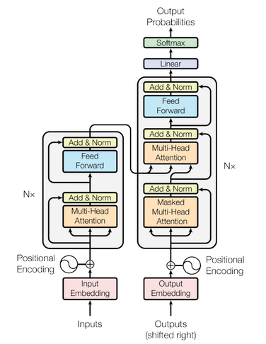

## **Transformers**

Transformers have revolutionised the AI space particularly NLP. It has improved areas such as;
- Machine translation.
- Next word prediction.
- Text classification and so much more.

In this repo, the transformer architecture is implemented;
Starting from 
1. Positional encoding
2. Scaled dot product
3. Multihead attention
4. Encoder
5. Decoder

References

- [Reference Guide](https://machinelearningmastery.com/)
- [Attenetion Is All You Need](https://arxiv.org/abs/1706.03762)